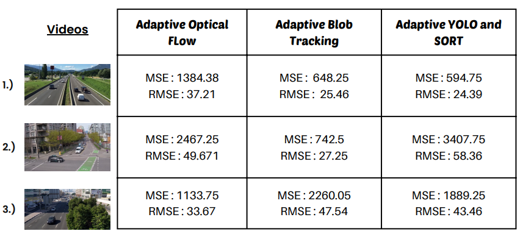
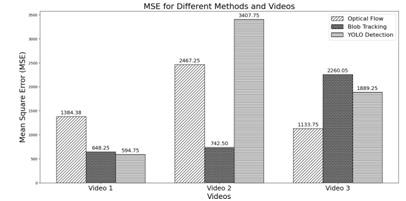
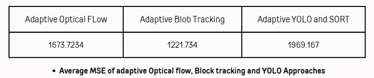
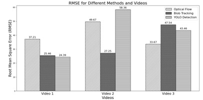
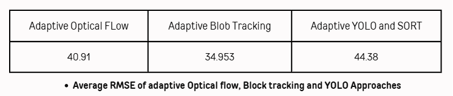
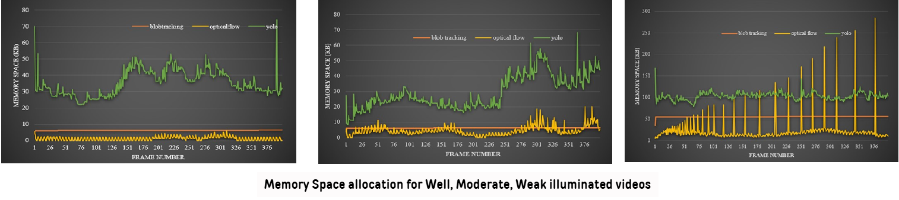
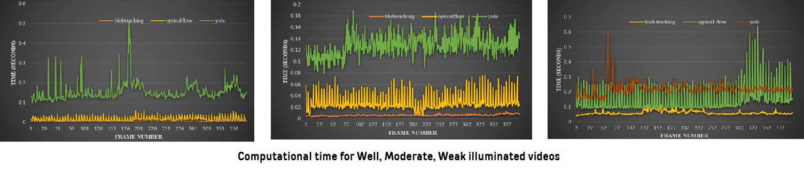
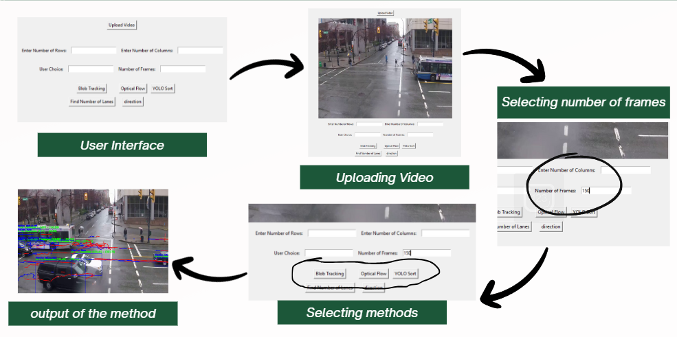
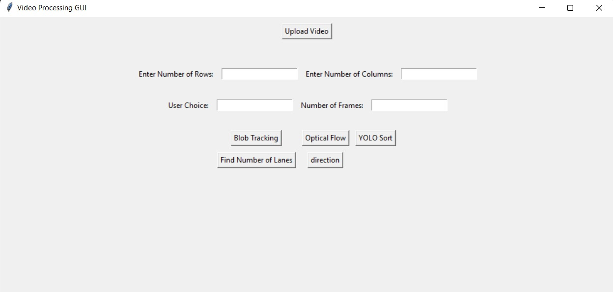
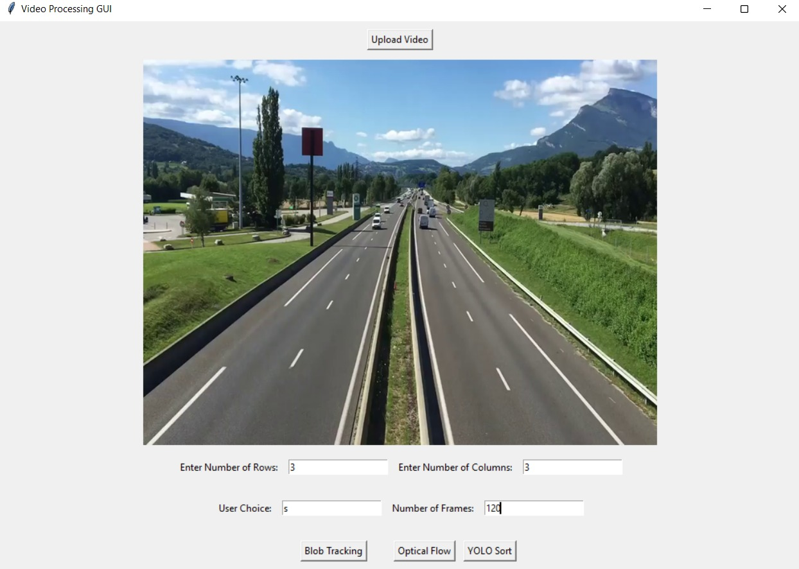

<h1 align="center">Comparitive Analysis of Heuristic Techniques for vehicles movement detection</h1>
<h3 align="center">The Bachelor's thesis project (BTP) </h3>
<h3 align="center">The goal of this project is to develop and compare algorithms which detect the boundaries of the region of vehicles movement in different directions </h3>
<h4 align="center">Dataset available at <a href="https://drive.google.com/drive/folders/1bIZRoKkS__D0MvD7Ns8Yih2byix4RnoB?usp=sharing" target="blank">https://drive.google.com/drive/folders/1bIZRoKkS__D0MvD7Ns8Yih2byix4RnoB?usp=sharing</a> </h3>

<h2 align="left">Motivation :</h2>

While existing research predominantly relies on deep learning for motion boundary detection, these approaches often entail extensive training on large datasets, leading to high computational costs and increased complexity. To mitigate these challenges, this paper proposes three alternative algorithms that leverage existing methods, avoiding the need for intensive training phases while maintaining robust performance in real-world traffic scenarios.


<h2 align="left">Tech Stack and Tools :</h2>
<p>
<a href="https://www.python.org/" target="_blank" rel="noreferrer">  </a>
<a href="https://opencv.org/" target="_blank" rel="noreferrer">  </a>
<a href="https://docs.python.org/3/library/tkinter.html" target="_blank" rel="noreferrer">  </a>
<a href="https://www.jetbrains.com/pycharm/" target="_blank" rel="noreferrer">  </a>
<a href="https://code.visualstudio.com/download" target="_blank" rel="noreferrer">  </a>
<a href="https://www.canva.com/en_in/" target="_blank" rel="noreferrer">  </a>

<h2 align="left">Overall Workflow</h2>
 

<h2 align="left">Data Pre-processing</h2>
<h3 align="center">Road Surface segmentation</h3>
 

<h2 align="left">Adaptive Algorithms</h2>


<h3 align="center">Adaptive Optical Flow</h3>

- Lucas- Kanade Optical flow is Useful for tracking objects in video footage

- Estimate the locations of keypoints in the current frame using previous frame

- The algorithm checks the consistency of these estimates and only the points with consistent estimates are added into trajectory

- The points which are at a consistent distance from previous feature point in the trajectory are only considered

- Direction vectors of vehicles are estimated using last 2 points of trajectories

- Based on direction vectors, the direction of vehicle and the boundaries in that specific direction are decided

 


<h3 align="center">Adaptive Blob Tracking</h3>

- Using Blob tracking we can detect and track the vehicle (Blobs)

- By Using the SORT Algorithm we can find the multiple objects in a video sequence

- Based on the current position and previous position of the blob, it decides the direction of the vehicle 

- Assigning different colors to vehicles in each direction

- From vehicle tracker , by using co-ordinates of every vehicles the left and right trajectorys of the vehicle can be drawn

- Based on the Above, boundaries in that specific direction are determined.

 


<h3 align="center">Adaptive YOLO and SORT</h3>

- Using YOLO to get the detections of vehicles moving

- Using the detections to track the vehicles using SORT Algorithm

- Considering the current position and previous position of each vehicle, to decide the direction of the vehicle

- Finding the tracking ID of the vehicles which represent the boundary in that direction

- Considering the trajectory of that vehicle, gives the boundary in that direction

- Two cases, to confirm the vehicle is moving in that direction using x, y coordinates

- Vice-versa, used to detect boundary of that direction
  
 


<h2 align="left">Comparitve Analysis</h2>

- Approaches implemented are prediction tasks

- Considering Standard metrics for evaluating the performance, Mean Square Error(MSE), Root Mean Square Error(RMSE) are taken

  

<p align="center">
 
 
</p>

<p align="center">
  
 
</p>

<h3 align="center">Analysis of Results</h3>

- **Adaptive Blob Tracking :** Bounding boxes adjust as the vehicle moves away, closely matching the predicted and actual boundaries, minimizing error
  
- **Adaptive Optical Flow :** Boundary detection relies on feature points. As the vehicle recedes, fewer features are detected, decreasing boundary accuracy and increasing error
  
- **Adaptive YOLO and SORT :** The bounding box size remains nearly constant, occasionally exceeding the vehicle’s size as it moves, which raises error in boundary detection

 

 


<h2 align="left">Dynamic Thresholding (Utilized in Road Surface Segmentation Process) </h2>

- Manualthresholding uses a fixed threshold for all pixels in the image.

- Hence, it cannot deal with images containing, for example, a strong illumination gradient or weak-illumination gradient.

- Adaptive or Dynamic thresholding changes the threshold dynamically over the image.

- This more sophisticated version of thresholding can accommodate changing lighting conditions in the image.


<h3 align="center">Chow and Kaneko Dynamic Thresholding :</h3>

- Chow and Kaneko divide an image into an array of overlapping subimages and then find the optimum threshold for each subimage by investigating its histogram

- The image is divided into small overlapping windows of size window_size × window_size. Each window represents a localregion around a pixel.

- The threshold for each single pixel is found by interpolating the results of the subimages.

- The threshold T(i,j) for each pixel (i,j) is calculated using the Chow and Kaneko formula:

<p align="center">
   
</p>

- If I(i,j)>T(i,j)the pixel is setto 255 (white, foreground).

- Otherwise, itis setto 0 (black, background).


<h3 align="center">Local Adaptive Thresholding :</h3>

- This method statistically examines the intensity values of the local neighborhood of each pixel.

- The size ofthe neighborhood has to be large enough to cover sufficientforeground and background pixels, otherwise a poor threshold is chosen. (Window size: k x k)

- Within the localregion, a Gaussian kernel is applied. A Gaussian kernel assigns more weightto pixels closerto the center of the region and less weightto pixels farther away.

  <p align="center">
     
  </p>

- The weighted sum of pixel intensities within the localregion is computed using the Gaussian weights. This gives the localthreshold (T) for the pixel.

- If I(i,j)>T the pixel is setto 255 (white, foreground).

- Otherwise, itis setto 0 (black, background)


<h3 align="center">Otsu’s Thresholding  :</h3>

- Compute the histogram of the grayscale image and the histogram represents the frequency of each intensity value (0–255 for 8-bitimages).

- Normalize the histogram to calculate probabilities P(i) of each intensity i.

- For each threshold t, Divide the histogram into two classes : 1.) Class 1(Background): Intensities [0,t] 2.) Class 2 (Foreground): Intensities [t+1,255]

- Compute the probabilities of each class :
  
 <p align="center">
  
 </p> 

- Calculate the mean intensity of each class:

 <p align="center">
 
 </p> 
 
- Calculate the between-class variance :  

 <p align="center">
  
 </p> 
 
- Identify the threshold that maximizes the between-class variance:   
 
 <p align="center">
 
 </p> 

<h3 align="center">Dynamic Thresholding Example : (With Comparison with Manual Thresholding)</h3>

<p align="center">
   
</p>

<h2 align="left">Conclusion</h2>

- This research presents a novel framework to assess the effectiveness of Multi-layer Contiguous Virtual Layer (MCVL) in vehicle detection

- It compares three heuristic methods—based on optical flow, blob tracking, and YOLO sort algorithms—for detecting vehicle movement in traffic videos

- Unlike existing research that relies heavily on deep learning, which has notable drawbacks, this study proposes adaptive approaches as alternatives and evaluates them using metrics like Mean Square Error (MSE) and Root Mean Square Error (RMSE)

- Each approach is explained with visual interpretations of the results to aid understanding.


<h2 align="left">Uniqueness</h2>

- The adaptive algorithms are innovative and diverge from traditional deep learning-based solutions.

- Each algorithm has unique strengths and limitations, adapting differently across various types of videos.

- Comparative analysis equips users to choose the optimal algorithm based on specific scenarios.

- The interface is designed to be visually appealing, adding to the project’s usability.

- This blend of functionality and aesthetics provides users with an enriched experience.


<h2 align="left">User Interface</h2>

- It offers different options, such as choosing algorithms and entering the number of frames.  

- This makes it useful for both automatic and custom tasks

- Users can quickly choose and run algorithms without needing to change any code, which makes the process faster and easier

- You can access the codefiles which are present in the **UI** folder inside the **Source_Code** folder

 
 



<h2 align="left">Setup and Installation</h2>

- To get started with this project, Place the test videos from the dataset link in the videos folder

- Next, clone the repository and install the necessary libraries in your system

```bash
# Clone the repository
git clone https://github.com/Rupesh2728/Comparitive-Analysis-of-Heuristic-Techniques-for-vehicles-movement-detection.git

# Navigate to the project directory
cd Comparitive-Analysis-of-Heuristic-Techniques-for-vehicles-movement-detection-main

# Source-Code
# For the purpose of Logic, Navigate to Source_Code directory
cd Source-Code

# You find the files of all the three algorithms
# Install necessary python dependencies and run the required files


# GUI
# For the purpose of UI, Navigate to UI directory
cd UI

# To run the GUI, run "gui.py" with necessary dependencies installed
python gui.py
```
- Project is ready for execution !!!
  
<h2 align="left">Contact Me</h2>

- 📫 You can to reach me by mailing to **rupesh.p21@iiits.in** or **rupeshprofessional2728@gmail.com**

- 👨‍💻 Project is available at [https://github.com/Rupesh2728/Comparitive-Analysis-of-Heuristic-Techniques-for-vehicles-movement-detection.git]
  


